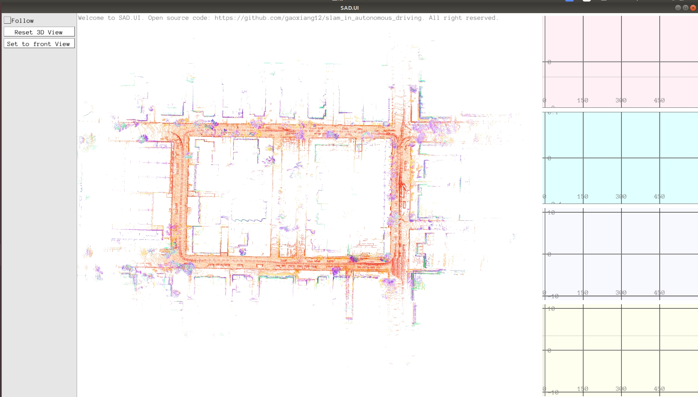
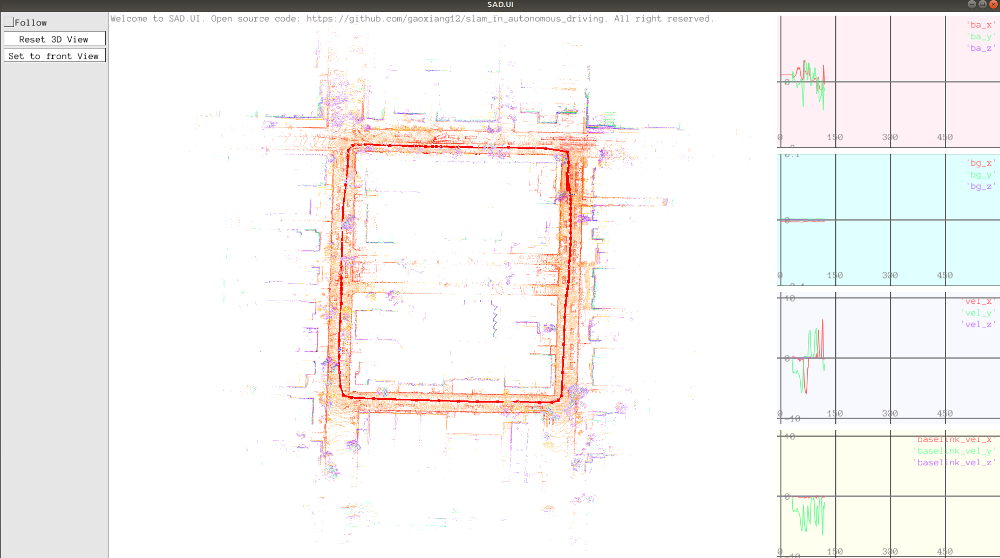
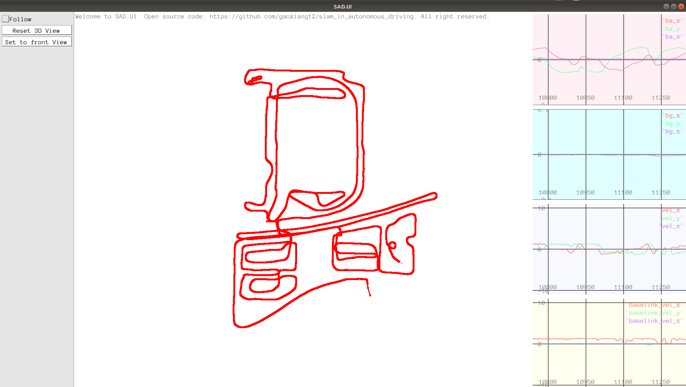
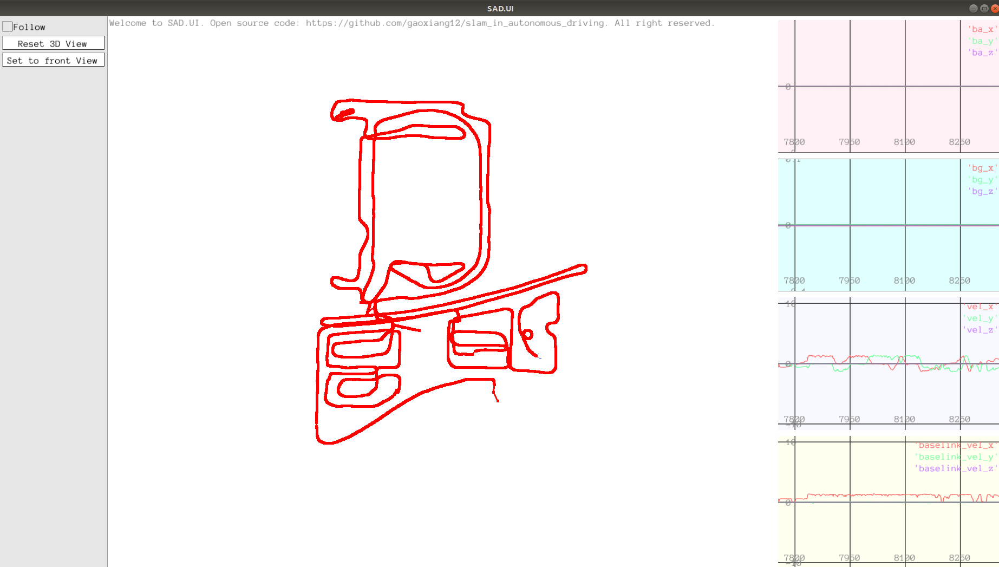
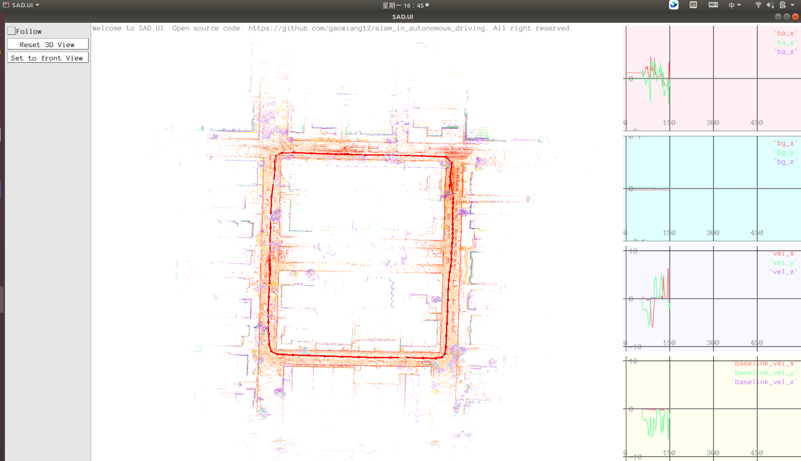
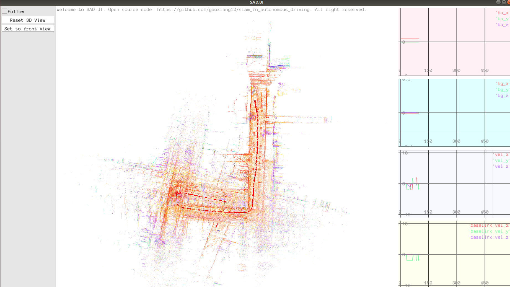
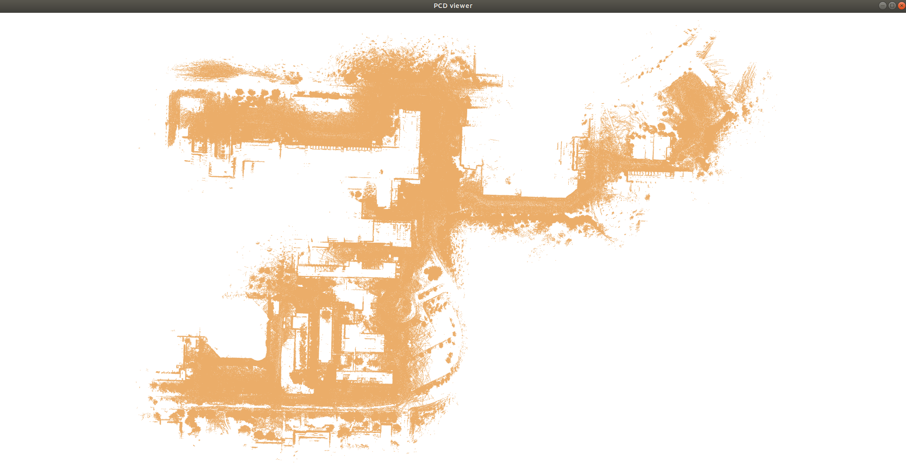
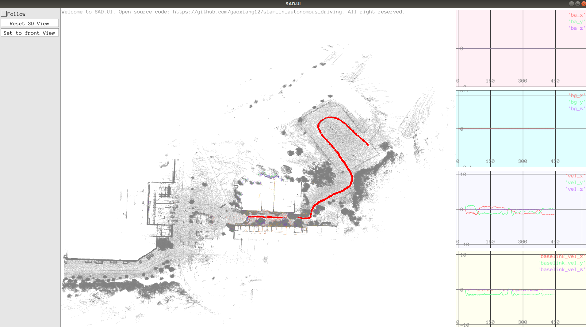

# introduction  
this is about mapping and localization by using lidar, imu, gps and wheel speed sensor; by using eskf, ieskf, g2o method.

function_01 : lidar only odometry by using incremental ndt method.   
./bin/run_inc_ndt_lidar  

function_02 : lidar and imu odometry by using loosely coupled eskf method.   
./bin/run_eskf_imu_lidar  

function_03 : imu, gps and wheel_speed odometry by using loosely coupled eskf method.
./bin/run_eskf_imu_gps_wheel

function_04 : imu, gps and wheel_speed odometry by using loosely coupled g2o method.   
./bin/run_g2o_imu_gps_wheel   

function_05 : lidar and imu odometry by using tightly coupled ieskf method.   
./bin/run_ieskf_imu_lidar  

<!-- function_06 : lidar and imu odometry by using tightly coupled g2o method.
./run_g2o_imu_lidar -->
<!--  -->

function_06 : offline build map with loop-closing by using imu, lidar and RTK sensor and using g2o method.   
完整的点云建图可以看成是一个 RTK、IMU、轮速、激光的综合优化问题.   
与在线 SLAM 系统不一样,地图构建系统完全可以工作在离线模式下。离线系统的一大好处
是有很强的确定性。每一个算法步骤应该怎样做,产生怎样的输出,都可以事先规划和确定下来。
模块与模块之间也没有线程、资源上的调度问题,而在线系统往往要考虑线程间的等待关系,例
如后端的回环检测在计算完成之前是否要插入新的子地图、是否允许导出回环检测未闭合的地图,
等等。所以,按照离线系统来设计建图框架,会比实时 SLAM 系统更加容易,也可以实现更好的
自动化能力。  

./bin/run_mapping  
./bin/run_spilt_map   
./bin/run_dump_map   

function_07 : online localization based offline lidar map.    
把当前激光扫描数据与加载的离线地图进行匹配,从而获得车辆自身的位置,再与 IMU 等传感器进行滤波器融合得到一个基于卡尔曼滤波器的实时定位方案。    
./bin/run_localization     
   

# dataset
https://pan.baidu.com/s/1ky_TDLMvdqJjwHuuuWquFA?pwd=1234    
note: split compress command   
tar -czv test3.bag | split -b 1000m - test3.tar.gz   
cat test3* > test3.tar.gz    
tar -xvf test3.tar.gz    

# docker environment
step_1: installl docker by command -- sudo apt  install docker.io  
step_2: download lidar_slam.tar from path https://pan.baidu.com/s/1ky_TDLMvdqJjwHuuuWquFA?pwd=1234     
step_3: import docker image by command -- docker load -i lidar_slam.tar  
step_4: docker run -it -v /home/hongfeng/workspace_18_04/:/workspace_18_04/ -v /tmp/.x11-unix:/tmp/.x11-unix -e DISPLAY=unix$DISPLAY -e GDK_SCALE -e GDK_DPI_SCALE --net=host --name lidar_slam lidar_slam:V1.0 /bin/bash  
others useful docker command:    
docker exec -it lidar_slam bash    
docker ps -a    
docker start lidar_slam     
docker stop lidar_slam    
docker rm lidar_slam    
docker rmi 8ae5b6462b6d     
save container to image :      
docker commit <container id> <image name>:<tag> -- docker commit ff3e1af39fd3 lidar_slam:V1.0     
docker save -o <filename>.tar <image name>:<tag> -- docker save -o lidar_slam.tar lidar_slam:V1.0     

# make gif
use obs to record mp4 video  
ffmpeg -i small.mp4 small.gif   

# hardware
ThinkPad T14 Core i7 8 core, 32G memory

# reference
https://github.com/gaoxiang12/slam_in_autonomous_driving